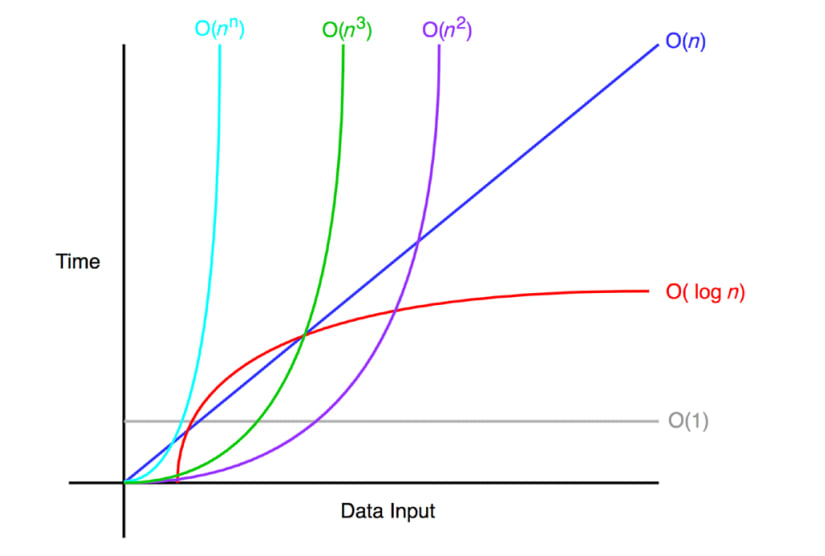

# 빅오(Big-O) 표기법
- 빅오 표기법은 해당 알고리즘이 얼마나 효율적인지 나타내어 `시간 및 알고리즘 공간 복잡도`를 분석하기 위한 개념으로, 며 빅오 표기법은 알고리즘의 `최악의 경우`에 대한 복잡도를 측정한다.
    - 일반적인 빅오 복잡도
    

# 일반적인 예시
## 일반적인 예 - O(1)
- 배열에 있는 항목을 `인덱스를 사용해 접근`하는 경우 O(1)이라고 할 수 있다. O(1)은 입력 공간에 대해 변하지 않으며, 따라서 O(1)을 `상수 시간`이라고 부른다.
- 예시 코드
    ```
    const arr = [1, 2, 3, 4];

    // 배열에 인덱스를 사용해 접근
    const choice = arr[2];
    console.log(choice); // 3 출력됨.
    ```
- 하미드 티주쉬(Hamid Tizhoosh): "O(1)은 신성하다."

## 일반적인 예 - O(n)
- O(n)은 `선형 시간`이고 `최악의 경우에 n번의 연산을 수행`해야 하는 알고리즘에 적용된다.
- 예시 코드
    ```
    // 0부터 n-1까지의 숫자를 출력한다.
    const exampleLinear = (n: number) => {
        for(let i = 0; i<n; i++){
            console.log(i);
        }
    }
    ```

## 일반적인 예 - O(n^2), O(n^3)
- O(n)과 마찬가지로 O(n^2)은 `2차 시간`이고, O(n^3)은 `3차 시간`이다.
- 2차 시간 예시 코드 - O(n^2)
    ```
    const exampleQuadratic = (n: number) => {
        for(let i = 0; i<n; i++){
            console.log(i);
            for(let j = i; j<n; j++){
                console.log(j);
            }
        }
    }
    ```
- 3차 시간 예시 코드 - O(n^3)
    ```
    const exampleCubic = (n: number) => {
        for(let i = 0; i<n; i++){
            console.log(i);
            for(let j = i; j<n; j++){
                console.log(j);
                for(let k = j; k<n; k++){
                    console.log(k);
                }
            }
        }
    }
    ```


## 일반적인 예 - O(logN)
- 로그 시간 복잡도의 효율은 백만 개의 항목과 같이 큰 입력이 있는 경우에 분명하다.
- n이 백만이라고 하더라도 exampleLogarithmic은 log2(1,000,000) = 19.9315686이기 때문에 단지 19개의 항목만을 출력한다.
- 마지막으로 로그 시간 복잡도를 지닌 알고리즘의 예는 2의 2승부터 n승까지의 항목들을 출력하는 경우가 있다.
- 예시 코드
    ```
    const exampleLogarithmic = (n: number) => {
        for(let i = 2; i<=2; i=i*2){
            console.log(i);
        }
    } 
    exampleLogarithmic(10); // 2, 4, 8, 16, 32, 64
    ```


# 시간 복잡도와 공간 복잡도
- f(n) 은 시간 복잡도와 공간 복잡도를 나타내는 함수이다. 알고리즘의 시간 복잡도를 f(n)이라고 표현하면 n은 입력의 개수를 나타내고, f(n)time 은 필요한 시간을 나타내고, f(n)space 는 필요한 추가적인 메모리 공간을 나타낸다.
- 알고리즘 분석의 목표는 f(n)time과 f(n)space를 계산하여 알고리즘의 효율성을 평가하는 것이다. 이를 통해 입력크기 n이 커질 때 알고리즘이 얼마나 빠르게 실행되고 얼마나 많은 메모리 공간을 사용하는지 이해할 수 있다.


## 시간 복잡도 (Time Complexity)
- f(n)time은 알고리즘이 실행되는 데 걸리는 시간을 의미한다.
- 이는 입력 크기 n에 대한 함수로 표현되며, 주로 입력 크기가 증가함에 따라 알고리즘의 실행 시간이 어떻게 변하는지를 나타낸다.
    - ex) 어떤 알고리즘의 시간 복잡도가 O(n^2)라고 하면, 입력 크기가 n일 때 최악의 경우에 그 알고리즘은 약 n^2 만큼의 연산을 필요로 한다는 의미이다.

## 공간 복잡도 (Space Complexity)
- f(n)space는 알고리즘이 실행되는 동안 필요한 추가적인 메모리 공간을 의미한다.
- 이는 입력 크기 n에 대한 함수로 표현되며, 주로 입력 크기가 증가함에 따라 알고리즘이 얼마나 많은 메모리를 필요로 하는지를 나타냅니다.
    - 예를 들어, 어떤 알고리즘의 공간 복잡도가 O(n)이라고 하면, 입력 크기가 n일 때 그 알고리즘은 약 n만큼의 추가적인 메모리 공간을 필요로 한다는 의미이다.


# 빅오 표기법 규칙
- 계수 법칙
    - 계수 법칙은 입력 크기 n과 관련되지 않은 계수를 제거하는 것이다.
    - 상수 k가 0보다 크다고 할 때(상수 k > 0), f(n)이 O(g(n))이면 kf(n)은 O(g(n))이다. 이것은 빅오 표기법의 특성 중 하나로, 상수 배율은 빅오 표기법의 상한선에 영향을 주지 않는다는 것을 보여준다.
    - 예시 코드
        - 기본 함수 f(n): 시간 복잡도 O(n)으로, 배열의 모든 요소를 출력하는 함수이다.
            ```
            const printElements = (arr: number[]) => {
                for (let i = 0; i < arr.length; i++) {
                    console.log(arr[i]);
                }
            }

            const arr = [1, 2, 3, 4, 5];
            printElements(arr); // 1 2 3 4 5
            ```
        - 계수 k를 곱한 함수 kf(n): 이 함수는 배열의 모든 요소를 k번 출력하며 시간 복잡도는 여전히 O(n)이다. 상수 k는 무시된다.
            ```
            const printElementsMultipleTimes = (arr: number[], k: number) => {
                for (let i = 0; i < k; i++) {
                    for (let j = 0; j < arr.length; j++) {
                        console.log(arr[j]);
                    }
                }
            }

            const arr = [1, 2, 3, 4, 5];
            const k = 3;
            printElementsMultipleTimes(arr, k); // 
            ```
            - 각 요소에 대해 k번의 반복이 있으므로, 실제 수행 시간은 k × n이다. 하지만 k는 상수이므로 빅오표기법에서는 무시된다.
            - 상수 계수를 무시하는 이유는 빅오 표기법은 입력 크기 n이 커질 때의 성장률에 초점을 맞추기 때문이다. 상수 계수는 n이 매우 클 때 성능에 상대적으로 작은 영향을 미치기 때문에 무시된다. 따라서, 상수 k를 곱하더라도 시간 복잡도는 여전히 O(n)이다.
